# Diagrama do banco

21 tabelas (PostgreSQL 16), geradas por `prisma/migrations`. O diagrama abaixo usa
Mermaid — o GitHub renderiza direto; em editor local, qualquer visualizador Mermaid
serve.

Legenda dos grupos:

- **TCC** — as cinco tabelas do dicionário de dados original + as três extensões
  justificadas (notificações, auditoria, consentimentos);
- **v2** — reputação;
- **v3** — SaaS (equipe e assinatura);
- **v4** — financeiro, relacionamento e comunicação do evento.

```mermaid
erDiagram
    EMPRESAS ||--o{ MEMBROS : "equipe (v3)"
    EMPRESAS ||--o| ASSINATURAS : "plano (v3)"
    EMPRESAS ||--o{ EVENTOS : organiza
    EMPRESAS ||--o{ VINCULOS : "habilita trabalhador"
    EMPRESAS ||--o{ PAGAMENTOS : "deve (v4)"
    EMPRESAS ||--o{ FECHAMENTOS_CAIXA : "fecha caixa (v4)"
    EMPRESAS ||--o{ TRABALHADOR_FAVORITOS : "favorita (v4)"
    EMPRESAS ||--o{ TRABALHADOR_BLOQUEIOS : "bloqueia (v4)"
    EMPRESAS ||--o{ AVALIACOES : "avalia trabalhador"

    USERS ||--o{ VINCULOS : solicita
    USERS ||--o{ INSCRICOES : "candidata-se"
    USERS ||--o{ NOTIFICACOES : recebe
    USERS ||--o{ CONSENTIMENTOS : "LGPD"
    USERS ||--o{ AVALIACOES : "recebe/avalia"
    USERS ||--o{ PAGAMENTOS : "recebe (v4)"
    USERS ||--o{ CONTESTACOES_PAGAMENTO : "contesta (v4)"
    USERS ||--o{ SOLICITACOES_EVENTO : "pede (v4)"
    USERS ||--o{ MENSAGENS_COORDENADOR : "recebe individual (v4)"
    USERS ||--o{ TRABALHADOR_FAVORITOS : "é favoritado (v4)"
    USERS ||--o{ TRABALHADOR_BLOQUEIOS : "é bloqueado (v4)"

    MEMBROS ||--o{ NOTIFICACOES : "recebe (v4)"
    MEMBROS ||--o{ MENSAGENS_COORDENADOR : "envia (v4)"
    MEMBROS ||--o{ PAGAMENTOS : "registra (v4)"
    MEMBROS ||--o{ PAGAMENTO_LANCAMENTOS : "lança (v4)"
    MEMBROS ||--o{ REGISTROS_PRESENCA : "registra ponto (v4)"

    EVENTOS ||--o{ INSCRICOES : recebe
    EVENTOS ||--o{ AVALIACOES : contextualiza
    EVENTOS ||--o{ PAGAMENTOS : "gera (v4)"
    EVENTOS ||--o| FECHAMENTOS_CAIXA : "tem um (v4)"
    EVENTOS ||--o{ SOLICITACOES_EVENTO : "canal (v4)"
    EVENTOS ||--o{ MENSAGENS_COORDENADOR : "recados (v4)"

    INSCRICOES ||--o| REGISTROS_PRESENCA : "check-in/out (v4)"

    PAGAMENTOS ||--o{ PAGAMENTO_LANCAMENTOS : "histórico (v4)"
    PAGAMENTOS ||--o{ CONTESTACOES_PAGAMENTO : "contestações (v4)"
    PAGAMENTOS ||--o{ FECHAMENTO_CAIXA_ITENS : "conferência (v4)"
    FECHAMENTOS_CAIXA ||--o{ FECHAMENTO_CAIXA_ITENS : "itens (v4)"

    EMPRESAS {
        int id PK
        string nome
        char cnpj UK
        string email UK
        string senha_hash "não autentica mais (v3)"
        timestamp anonimizado_em "LGPD"
    }
    USERS {
        int id PK
        string nome
        string email UK
        char cpf UK
        date data_nascimento
        string cidade "v2"
        string habilidades "v2"
        enum pix_tipo "v4"
        text pix_chave_cifrada "v4 — AES-256-GCM"
        timestamp anonimizado_em "LGPD"
    }
    MEMBROS {
        int id PK
        int empresa_id FK
        string email UK "credencial de login (v3)"
        enum papel "PROPRIETARIO|ADMIN|COORDENADOR|VISUALIZADOR"
        bool autorizado_financeiro "v4"
        bool ativo
    }
    ASSINATURAS {
        int id PK
        int empresa_id FK "único"
        enum plano "STARTER|PROFESSIONAL|ENTERPRISE"
        enum status "TRIAL|ATIVA|INADIMPLENTE|CANCELADA"
        timestamp trial_termina_em
        string provedor "gancho de PSP"
    }
    EVENTOS {
        int id PK
        int empresa_id FK
        string nome
        date data_evento
        string hora_inicio "HH:MM"
        int vagas
        decimal valor_cache
        enum status "RASCUNHO|PUBLICADO|ESCALADO|FINALIZADO|CANCELADO"
    }
    VINCULOS {
        int id PK
        int user_id FK
        int empresa_id FK
        enum status "PENDENTE|ATIVO|RECUSADO|DESVINCULADO"
        enum solicitado_por
        bool favorito "do trabalhador sobre a empresa"
    }
    INSCRICOES {
        int id PK
        int evento_id FK
        int user_id FK
        enum status "INSCRITO|ESCALADO|RECUSADO_EMPRESA|CANCELADO_TRABALHADOR|PRESENTE|FALTA"
    }
    AVALIACOES {
        int id PK
        int evento_id FK
        int empresa_id FK
        int user_id FK
        enum autor "EMPRESA|TRABALHADOR"
        int nota "geral (média dos critérios na v4)"
        int nota_pontualidade "v4"
        int nota_comunicacao "v4"
        int nota_trabalho_equipe "v4"
        int nota_qualidade "v4"
        int nota_comprometimento "v4"
    }
    PAGAMENTOS {
        int id PK
        int evento_id FK
        int user_id FK
        int empresa_id FK
        decimal valor_devido
        decimal valor_pago "<= devido (CHECK)"
        enum status "PENDENTE|PARCIAL|PAGO|CANCELADO"
        enum forma "PIX|DINHEIRO|CARTAO_CREDITO"
        string funcao
        string hora_entrada
        string hora_saida
    }
    PAGAMENTO_LANCAMENTOS {
        int id PK
        int pagamento_id FK
        decimal valor "> 0 (CHECK)"
        enum forma
        string observacao
    }
    CONTESTACOES_PAGAMENTO {
        int id PK
        int pagamento_id FK "1 em aberto (índice parcial)"
        int user_id FK
        string motivo
        string descricao
        enum status "ABERTA|EM_ANALISE|RESOLVIDA|REJEITADA"
        string resposta
    }
    FECHAMENTOS_CAIXA {
        int id PK
        int evento_id FK "único"
        int empresa_id FK
        enum status "EM_ANDAMENTO|CONCLUIDO|CANCELADO"
        timestamp iniciado_em
        timestamp concluido_em
    }
    FECHAMENTO_CAIXA_ITENS {
        int id PK
        int fechamento_id FK
        int pagamento_id FK
        decimal valor_devido
        decimal valor_pago
        enum forma
        enum status
    }
    TRABALHADOR_FAVORITOS {
        int id PK
        int empresa_id FK
        int user_id FK
        string observacao
    }
    TRABALHADOR_BLOQUEIOS {
        int id PK
        int empresa_id FK
        int user_id FK
        string motivo "obrigatório"
        timestamp removido_em "null = vigente (índice parcial único)"
        string motivo_remocao
    }
    SOLICITACOES_EVENTO {
        int id PK
        int evento_id FK
        int user_id FK
        enum tipo "INTERVALO|DESCANSO|PROBLEMA|AJUDA|SUBSTITUICAO|FALAR_COORDENACAO"
        enum status "EM_ANALISE|AGUARDANDO|APROVADA|RECUSADA|FINALIZADA"
        string mensagem
        string resposta
    }
    MENSAGENS_COORDENADOR {
        int id PK
        int evento_id FK
        int membro_id FK
        int user_id FK "null = toda a equipe"
        string texto
    }
    REGISTROS_PRESENCA {
        int id PK
        int inscricao_id FK "único"
        timestamp check_in_em
        timestamp check_out_em
    }
    NOTIFICACOES {
        int id PK
        int user_id FK "XOR membro_id (CHECK)"
        int membro_id FK "v4"
        enum tipo
        string titulo
        bool lida
    }
    AUDIT_LOGS {
        int id PK
        enum ator_tipo "TRABALHADOR|EMPRESA|SISTEMA"
        int ator_id
        string acao
        string entidade
        int entidade_id
        string detalhe
        string ip
    }
    CONSENTIMENTOS {
        int id PK
        int user_id FK
        string finalidade
        string versao
        bool concedido
    }
```

## Restrições que não aparecem no diagrama

Escritas à mão nas migrations, porque o Prisma não as modela (motivos no
[ADR 0005](adr/0005-chave-pix-cifrada-e-rbac-financeiro.md)):

| Restrição | O que garante |
| --- | --- |
| `notificacoes_destinatario_exclusivo` | notificação tem exatamente um destinatário: trabalhador **XOR** membro |
| `pagamentos_valores_nao_negativos` | valor devido e pago nunca negativos |
| `pagamentos_pago_nao_excede_devido` | não se paga mais do que o combinado |
| `pagamento_lancamentos_valor_positivo` | lançamento de R$ 0 não é pagamento |
| `avaliacoes_notas_1_a_5` | nota geral e os cinco critérios em 1..5 |
| `trabalhador_bloqueios_vigente_unico` (índice parcial) | um bloqueio **vigente** por par empresa×trabalhador, preservando histórico |
| `contestacoes_abertas_unica_por_pagamento` (índice parcial) | uma contestação **em aberto** por pagamento |

## Ciclos de vida

- **Vínculo:** `PENDENTE → ATIVO | RECUSADO`; `ATIVO → DESVINCULADO` (bloqueio também
  desvincula).
- **Evento:** `PUBLICADO → FINALIZADO` (reabrível) · `→ CANCELADO`.
- **Inscrição:** `INSCRITO → ESCALADO | RECUSADO_EMPRESA | CANCELADO_TRABALHADOR`;
  `ESCALADO → PRESENTE | FALTA` (check-in marca PRESENTE).
- **Pagamento:** `PENDENTE → PARCIAL → PAGO`; estorno volta a `PENDENTE` **sem apagar
  lançamentos**.
- **Fechamento de caixa:** `EM_ANDAMENTO → CONCLUIDO` (reabrível) · `→ CANCELADO`.
- **Solicitação:** `EM_ANALISE → APROVADA | RECUSADA | AGUARDANDO`;
  `AGUARDANDO → APROVADA | RECUSADA | FINALIZADA`; `APROVADA → FINALIZADA`.
  `RECUSADA` e `FINALIZADA` são terminais
  ([ADR 0007](adr/0007-comunicacao-do-evento-janela-e-tempo-real.md)).
- **Contestação:** `ABERTA → EM_ANALISE | RESOLVIDA | REJEITADA`.
